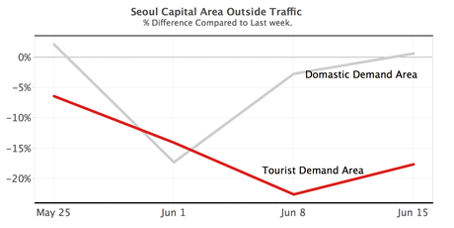
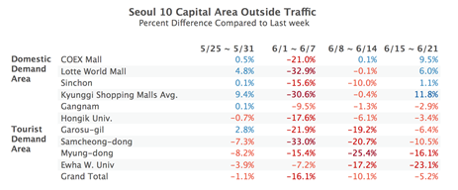
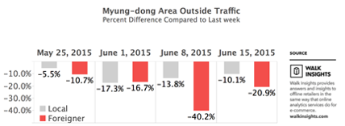

The retail industry is having a harder time than ever due to the Middle East Respiratory Syndrome (MERS). Although the first patient was confirmed for more than a month ago, the impact is not likely to recover quickly as the consumer sentiment caused by the MERS shrinks. 
 
March 23 - ZOYI Corporation, an offline customer analytics company, released the report of outside traffic analysis of the major commercial districts in the Seoul metropolitan area. In the 1st week of June, when the mayor of Seoul emergency briefing was conducted, the traffic in all business districts dropped by an average of 16.1% from the previous week. 

 
Among them, Chinese tourists (Euckers) market, including Myeong-dong, Samcheong-dong, Garosu-gil, and Ewha University district, plunged the most. In this period, outside traffic of Samcheong-dong declined the most by 33%, followed by Garosu-gil with 21.9% and Myeong-dong with 15.4%. After the government announced its list of dedicated hospitals on March 7, retailers seemed to be getting brisk. Still, Myeong-dong, Samcheong-dong, Garosu-gil, and Ewha Univ. district were 25.4%, 20.7%, 19.2%, and 17.2%, respectively, showing a steady decline. In the 4th week, except for the Garosu-gil, the number of double-digit decline was recorded. 
 
However, during the same period, the domestic district was relatively stable. The Gangnam commercial district near Samsung Seoul Hospital, which is currently the center of the MERS epidemic, was expected to have suffered a severe blow. Still, Gangnam Station has not experienced a sharp decline in traffic compared to other commercial areas. Also, in the 4th week, large shopping malls such as COEX Mall, Lotte World Mall, and Shinchon area showed an increase compared to the previous week. It is analyzed that the mood is recovering around 20 ~ 30’s dating people who feel relatively safe for MERS. 

 
In the case of Myeong-dong, a representative of tourists, the decline rate of locals in the traffic slowed down by 17.3% in the 2nd week, 13.8% in the 3rd week and 10.1% in the 4th week, while foreigners decreased 16.7% in the 2nd week, 38.8% in the 3rd week and 20.9% in the 4th week. 

 
Shin Ji-sun, 33, working in Beijing, China, said, "I was going to go to Seoul this season, but my colleagues ask me is it ok to go. China seems to be more afraid of MERS.” 
 
"In the 2nd week of June, the outside traffic declined by 10.1% and the 3rd week by 5.2%, the rate of decline decelerated to half the level of the previous week," said Elly Han, Insights Director of ZOYI Corporation. She continued, "The number of discharged patients is increasing, and the isolation is lifted, so I think that there is a certain degree of relief. If this sentiment continues, most of the retailers expect to recover their vitality from the end of June to early July. However, in the case of the foreign demand area, the impact is likely to be prolonged, so the government should take measures." 

#### Original text: [Maeil Business News](https://www.mk.co.kr/news/business/view/2015/06/597445/)